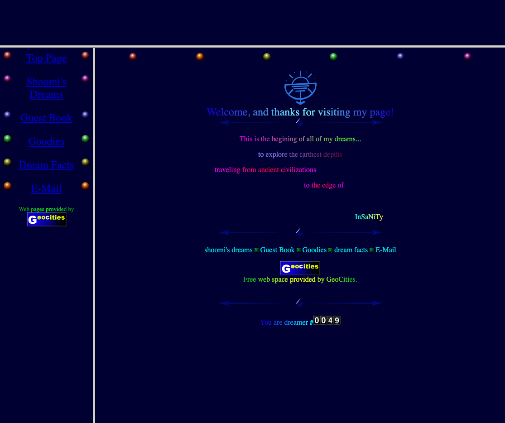
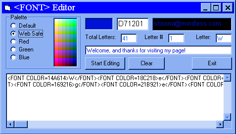

# Athens-Acropolis-4507

I got a GeoCities web page in the 90's. This was my first web page. My account was `moonhalo`, and I went by `Shoomi` as the online persona.

I had archived a few of my web sites and made a CD Resume in 1999. Some of the content had been changed to support an offline version for viewing without an internet connection.

# 90's Nostalgia
Lots of cutting edge stuff here from the 90's.

- Frames
- Animated GIF's
- Banners
- Image Buttons
- Web Camera
- Visitor Counter
- Custom Font
- Music
- Guestbook
- JAVA Applet Marquee
- Text that changes colors
- No JavaScript
- No Cascading Stylesheets
- No Style Tags

# Font Editor
This little program was made using Visual Basic. It changed your text from one color to another as a gradient.

Windows Executable: [clr_fnt.zip](clr_fnt.zip)

# Custom Images
Just about every image was made by me except the Link Exchange banner. I'm uncertain about the "I Believe in Peace" image on the front page.

# Animated City

One thing of note here is the citiscape. I found a New York webcam online that showed a new picture every minute or so. I captured pictures for a few hours as the sun gradually went down. I used GIF Animator to create many of the animated GIF images, and used it to create an animation of the city at night. I used Adobe Photoshop to make the images a monotone color to reduce the color palette and make it fit in with the dream theme.

# Broken Stuff
- Inner Circle image on home page is broken, but it is here 
- MIDI file download. It used to play automatically in the browser.
- Fonts. Installing the included TTF fonts do not help change the appearance of the web page.
- Counter is static at 0049 for offline viewing.
- Link Exchange is static for offline viewing.
- LPage Guestbook. Host no longer available.
- Book of Dreamers Guesbook - was hosted at home. An archive is here at [book_of_dreamers.html]
- Marquee Applet - doesn't display in top frame. Should show a list of floating/wavey messages found in [dreamers.txt]
- Link to Lycos. They no longer use `cgi-bin` for their queries.
- Shoomi's Dreams Form Broken
- Email form doesn't work. The `moonhalo` account on GeoCities is no longer active, and I don't have access to my email at `mindless.com`.

# Banners
Banners were made for other pages to advertise the website.

LPage

Link Exchange

Geocities

