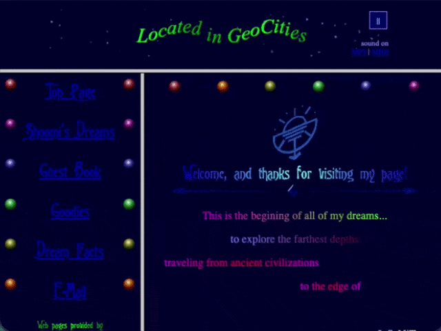

# Athens-Acropolis-4507

I got a GeoCities web page in the 90's. This was my first web page. My account was `moonhalo`, and I went by `Shoomi` as the online persona.

I had archived a few of my web sites and made a CD Resume in 1999. Some of the content had been changed to support an offline version for viewing without an internet connection.

# Restoration Notes
This archive has been partially modernized so the original experience can still be viewed in a current browser without needing legacy plugins or local font installs.

- The original Java applet marquee in `title_old.html` has been recreated with HTML5 canvas in `title.html` and `title.js`, using the original message flow from [dreamers.txt](dreamers.txt).
- The old embedded MIDI behavior has been replaced with a looping MP3 soundtrack plus a small themed play/pause control in the top frame.
- The `Burton's Nightmare` / `nitemare.ttf` font now loads as a webfont through `font.css`, which restores the intended look of the navigation and page titles.
- The old Visual Basic `Color Writer /  Editor` has been recreated as a browser app in `colorwriter.html` and `colorwriter.js`, including palette picking, per-letter anchor colors, gradient HTML output, and a live rendered preview.

# MIDI Restoration
The original site used an embedded MIDI file, `midi_song_newage.mid`, which modern browsers now tend to download instead of playing. To restore the mood of the page in a browser-friendly way, the MIDI was rendered to [midi_song_newage.mp3](midi_song_newage.mp3) and wired into the top frame with a themed inline player.

The render was not a straight one-click conversion. The local TiMidity patch set used for conversion was missing two of the General MIDI programs requested by the file:

- `50`: `Synth Strings 1`
- `99`: `Atmosphere`

To keep the result closer to the kind of late-90s Sound Blaster character the site originally had, [timidity-override.cfg](timidity-override.cfg) pins period-appropriate substitutes from the available patch bank:

- `35` -> `Fretless Bass`
- `50` -> `String Ensemble 1 Marcato`
- `99` -> `Goblins--Unicorn`

That last substitution is intentionally more Sound Blaster-flavored than a generic ambient pad. Old Creative-era banks commonly exposed nearby synth effect names like `Crystal`, `Atmosphere`, and `Goblins/Unicorn`, and the `Goblins--Unicorn` variant ended up sounding closer to the remembered original than the earlier `Crystal` test render. The goal was not perfect forensic recovery of the exact original sound card bank, but a restoration that feels closer to how the page likely sounded on 90s PC hardware.

# 90's Nostalgia
Lots of cutting edge stuff here from the 90's.

- Frames
- Animated GIF's
- Banners
- Image Buttons
- Web Camera
- Visitor Counter
- Custom Font
- Music
- Guestbook
- JAVA Applet Marquee
- Text that changes colors
- No JavaScript
- No Cascading Stylesheets
- No Style Tags

# Font Editor
This little program was made using Visual Basic. It changed your text from one color to another as a gradient.

Windows Executable: [clr_fnt.zip](clr_fnt.zip)

Modern HTML Version: [colorwriter.html](colorwriter.html)

The restored web version keeps the same late-90s `` workflow, but runs in a current browser and includes a live preview window so you can see the generated HTML as it would have looked on the site.

# Custom Images
Just about every image was made by me except the Link Exchange banner. I'm uncertain about the "I Believe in Peace" image on the front page.

# Animated City

One thing of note here is the citiscape. I found a New York webcam online that showed a new picture every minute or so. I captured pictures for a few hours as the sun gradually went down. I used GIF Animator to create many of the animated GIF images, and used it to create an animation of the city at night. I used Adobe Photoshop to make the images a monotone color to reduce the color palette and make it fit in with the dream theme.

# Broken Stuff
- Inner Circle image on home page link changed to relative vs absolute url. 
- MIDI autoplay is restored with a browser-friendly MP3 conversion ([TiMidity++](https://wiki.archlinux.org/title/Timidity++) and [LAME](https://lame.sourceforge.io/)) and inline themed playback control. The closest patterns found were from the stock TiMidity patch library:
  - 35 Fretless Bass
  - 48 String Ensemble 1 Marcato
  - 98 Crystal
  - 98 FX 3 (crystal)
  - 101 FX 6 (goblins unicorn)
- Fonts are restored with a webfont so the included `nitemare.ttf` displays again without local installation.
- Color Writer is restored as an HTML app so the old gradient text generator can be used without the original VB executable.
- Counter is static at 0049 for offline viewing.
- Link Exchange is static for offline viewing.
- LPage Guestbook. Host no longer available.
- Book of Dreamers Guesbook - was hosted at home. An archive is here at [book_of_dreamers.html]
- Marquee applet behavior is restored with a canvas recreation in the top frame. It shows the floating / wavey messages from [dreamers.txt](dreamers.txt)
- Link to Lycos. They no longer use `cgi-bin` for their queries.
- Shoomi's Dreams Form Broken
- Email form doesn't work. The `moonhalo` account on GeoCities is no longer active, and I don't have access to my email at `mindless.com`.

# Banners
Banners were made for other pages to advertise the website.

LPage

Link Exchange

Geocities

